# Du style à l'achat L'IA Comme moteur de conversion

## Cadrage Stratégique - Projet Fashion-Insta

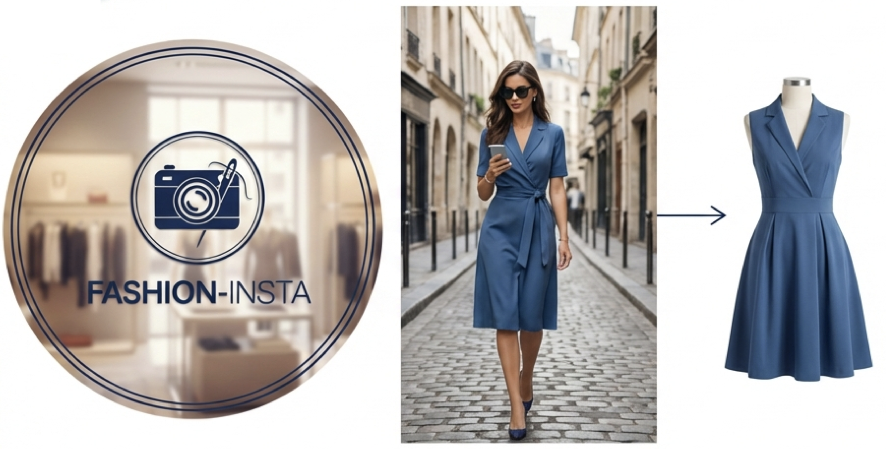

 
 
 
 

  <strong>Projet :</strong> Recommandation Vestimentaire par IA 
  <strong>Auteur :</strong> Damien GUESDON, AI Engineer 
  <strong>Date :</strong> Février 2026

<!--
Section 1 : Titre & Introduction (Slide 1)

 Bonjour. Je suis Damien, Ingénieur IA et Chef de Projet sur cette initiative.
 Nous sommes aujourd'hui réunis pour parler d'accélération.
 
 Fashion-Insta est un leader de la mode, mais l'expérience client digitale doit franchir un cap.
 L'objectif de cette présentation est de valider le lancement d'un POC (Proof of Concept) visant à transformer la façon dont les clients découvrent les produits.
 
 Nous allons voir comment l'IA peut transformer une simple inspiration visuelle en acte d'achat immédiat, de manière rentable, techniquement maîtrisée et juridiquement sécurisée.

💡 Antisèche (Q&A) :
• Pourquoi vous ? : "Je porte la vision technique tout en assurant l'alignement avec les enjeux business d'Alicia (VP Product)."
• Pourquoi maintenant ? : "La technologie est mature (Embeddings/Vision) et les concurrents prennent de l'avance. Le coût d'entrée a baissé, c'est le moment d'y aller." 

-->

---

# Le Constat : Une friction coûteuse

### Le Problème
        

  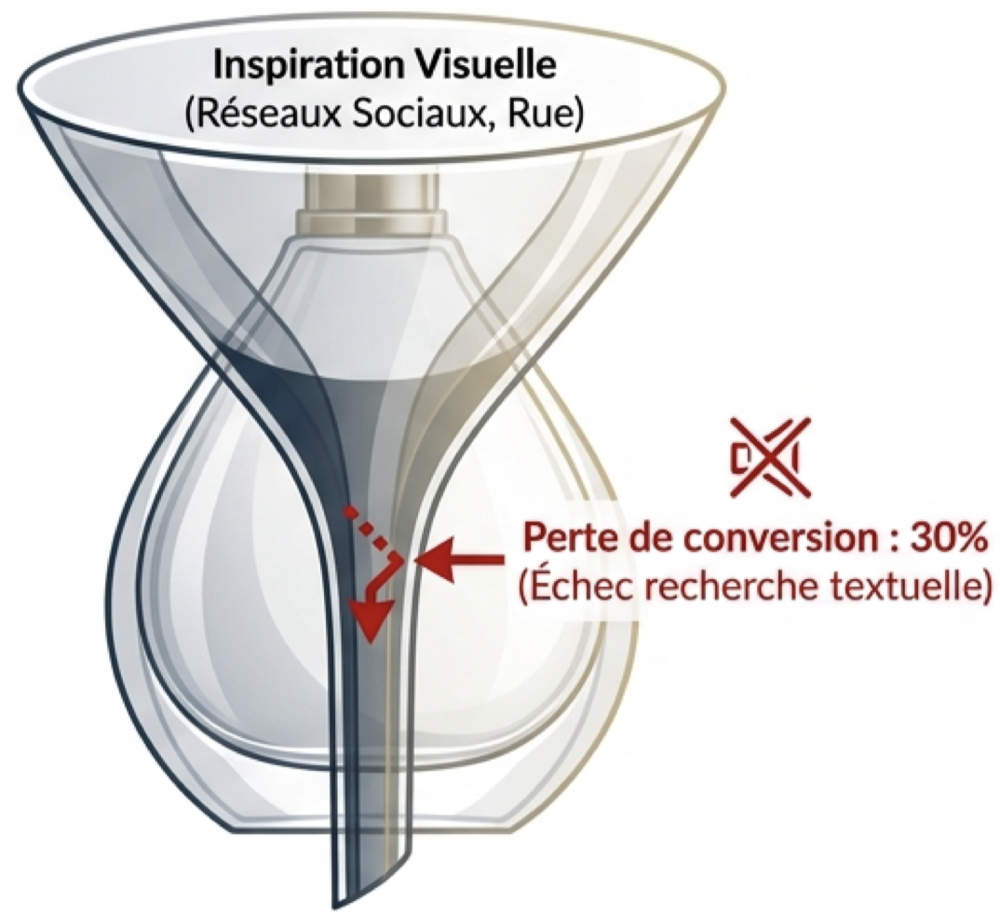

### L'Opportunité
        
<ul class="custom-list">
  <li>
     
    <strong>Mutation mobile</strong> : Capturer l'intention d'achat instantanément.
  </li>
  <li>
    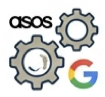 
    <strong>Retard stratégique</strong> : Combler l'écart avec les leaders.
  </li>
  <li>
     
    <strong>Vision</strong> : Devenir le "Shazam de la mode".
  </li>
</ul>

<!--
Section 2 : Contexte & Enjeux (Slide 2)

 Partons d'un constat simple mais douloureux :
 Aujourd'hui, quand un client voit un style qui lui plaît dans la rue ou sur Instagram.
 Il cherche... et souvent, il trouve son bonheur dans une autre enseigne, ou pire, il abandonne.
 
 Pourquoi ? Parce que décrire un vêtement avec des mots clés ('robe rouge fleurie') est laborieux et imprécis. Les chiffres du marketing sont clairs : 30% de perte de conversion potentielle à cause de cette friction.

 L'ambition ici est de supprimer cette barrière pour devenir le 'Shazam de la mode' :
 je vois, je scanne, j'achète.
 
 L'enjeu est de rattraper le retard technologique pour capturer cette intention d'achat instantanée.

💡 Antisèche (Q&A) :
• D'où vient le chiffre de 30% ? : "Ca nous vient de Gartner, qui stipulait en 2017 que les marques adoptant précocement la recherche visuelle et vocale augmenteraient leur chiffre d'affaires numérique de 30 %. Ce chiffre est encore accepté comme une norme aujourd'hui, je l'ai donc pris en référence"
• Google Lens ne fait pas déjà ça ? : "Si, mais Google renvoie vers tous les sites. Nous voulons garder le client dans notre écosystème et notre stock." 
-->

---

# La Solution : Une expérience "Scan & Shop" instantanée

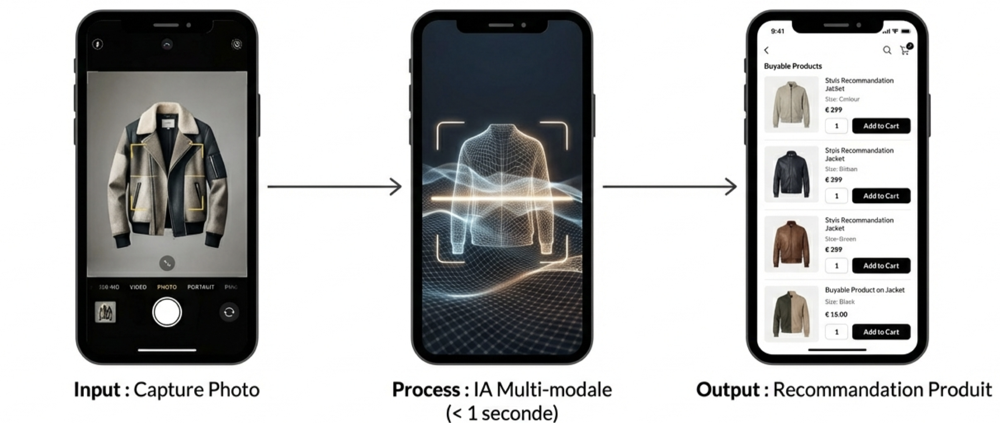

 

## **Fluidité absolue.** On ne cherche plus, on trouve.

<!--
Section 3 : La Mission / Concept (Slide 3)

 Concrètement, quelle est la promesse ? Elle tient en une phrase : 
 'Prenez une photo, nous trouvons le style.'
 
 L'utilisateur n'a plus besoin de décrire. Il uploade une photo. En moins d'une demi-seconde (500ms), l'IA analyse la coupe, la texture, la couleur, et lui propose les produits Fashion-Insta les plus similaires disponibles en stock. 
 C'est simple pour l'utilisateur, mais derrière, c'est une technologie de pointe en Computer Vision qui sera déployée.

💡 Antisèche (Q&A) :
• Est-ce que ça marche avec des photos floues ? : "L'IA est robuste, mais il y a des limites. Le POC servira justement à tester ces cas 'in-the-wild' (conditions réelles)."
• C'est une app à part ? : "À terme, ce sera une fonctionnalité intégrée dans l'app existante. Pour le POC, ce sera un prototype web isolé." 
-->

---

# Impact Business : Un levier de croissance quantifié

## **Impact Total :** Potentiel cumulé de **936k€ sur 2 ans**.

<!--
Section 4 : Valeur Ajoutée IA (Slide 4)
 
 Ici l'IA est un levier de croissance.
 En réduisant le temps de recherche de plusieurs minutes à quelques millisecondes, on fluidifie le parcours.
 Les projections, basées sur les données 2024, estiment un gain de chiffre d'affaires de 468 000 € par an.
 Le marketting prévoit ainsi une hausse du panier moyen (+14% en e-commerce) et d'un effet de +4% sur la vente en magasin (effet de la pub sur la nouveauté de l'app, et affichage des dispo ds el magasin le plus proche)

💡 Antisèche (Q&A) :
• Les +14% semblent optimistes ? : "C'est une hypothèse basée sur les benchmarks du secteur (McKinsey 2025) qui observent entre +15% et +30% de conversion sur les parcours de recherche visuelle."
• Et si on fait moins ? : "Même avec la moitié de ces gains, le projet reste rentable (nous verrons le ROI plus loin)." 
-->

---

# Stratégie POC : "Fail fast, learn fast"

  

    <h2>Objectif</h2>
    
Valider la faisabilité technique du cœur algorithmique en <strong>4 semaines</strong>.

  

  

    <h2>Périmètre</h2>
    
Focus exclusif sur le moteur de recommandation (Back-end uniquement).

  

  

    <h2>Données</h2>
    
Dataset de référence <strong>DeepFashion</strong> (~800k images) pour entraînement initial.

  

  

    <h2>Livrable</h2>
    
Un prototype fonctionnel démontrant la pertinence des recommandations.

  

<!--
Section 5 : Objectifs du POC (Slide 5)

 Alors, on ne va pas déployer directement. on adopte une approche 'Fail fast, learn fast'. (si n doit se tromper, il faut el faire le plus tôt possible pour ne pas persister dans l'erreur.
 
 L'objectif de ce POC est donc de valider la faisabilité technique en 4 semaines.
 On se concentre uniquement sur le cœur du réacteur : l'algorithme de recommandation.
 (l'implémentation avec le frontend n'interviendra que ds les phases suivantes)

 On utilise le dataset DeepFashion (800 000 images) pour l'entraînement initial, couplé à un extrait de notre catalogue.
 À la fin du mois, le livrable est un prototype fonctionnel : on met une image, on voit si les résultats sont pertinents."

💡 Antisèche (Q&A) :
• Pourquoi 4 semaines ? : "C'est le temps standard pour entraîner un modèle et valider une hypothèse sans engager trop de budget (Sprint Agile)."
• Pourquoi DeepFashion et pas nos données ? : "Pour aller vite. Nos données ne sont pas encore toutes annotées pour l'entraînement IA. DeepFashion est le standard académique pour démarrer."
-->

---

# Choix Technologique : Performance industrielle vs Hype

  
Approche A (Retenue) : Embeddings

  
Approche B (Exploratoire) : LLM Vision

  

    

      🔍
      <strong>Technologie :</strong> Vector Search (ResNet/ViT)
    

    

      ⏱️
      <strong>Latence :</strong> < 100ms (Ultra-rapide)
    

    

      $
      <strong>Coût :</strong> Faible (CapEx)
    

  

  

    

      🔍
      <strong>Technologie :</strong> GPT-5 Vision / Claude
    

    

      ⏱️
      <strong>Latence :</strong> > 2000ms (Trop lent pour mobile)
    

    

      $
      <strong>Coût :</strong> Élevé (OpEx)
    

  

 

## **Décision :** Priorité aux Embeddings pour garantir la fluidité et la rentabilité.

<!--
Section 6 : Approche Technique (Slide 6)

 Sur le plan technique, on a comparé deux routes. 
 L'Approche B : Utiliser les gros modèles type GPT-5 Vision. C'est impressionnant, mais c'est lent (> 2 secondes) et très cher à chaque requête.
 La solution retenue est l'Approche A : Les Embeddings. C'est une technologie mature de recherche vectorielle ultra-rapide (< 100ms) et beaucoup moins coûteuse.
 Pour l'utilisateur mobile, la fluidité est non-négociable. On peut garder les LLM uniquement en 'backup' pour des cas très complexes d'analyse de style, mais ce n'est pas le sujet du POC, le moteur principal sera vectoriel.

💡 Antisèche (Q&A) :
• C'est quoi un Embedding ? : "Imaginez que l'IA transforme une image en une liste de 512 chiffres (un code-barres unique). On compare ensuite ces chiffres mathématiquement pour trouver les plus proches. C'est instantané."
• Pourquoi GPT-5 est trop lent ? : "Il doit générer du texte pour décrire l'image, puis on cherche le texte. C'est une étape de trop pour du temps réel." 
-->

---

# Critères de Succès : Une évaluation scientifique

## **Hit@5** (Top-5 Accuracy)

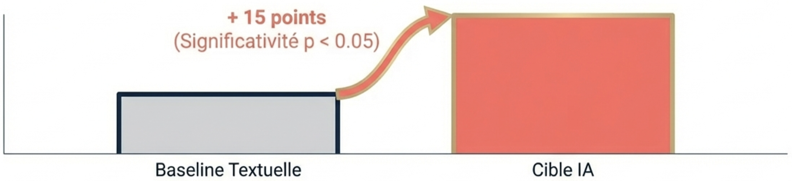

1.  **Technique** : Latence < 500ms.
2.  **Métier** : Validation experts > 80%.
3.  **Baseline** : Comparaison face à Mots-clés + Couleur.

<!--
Section 7 : Critères de Succès (Slide 7)

 La 'Star Metric' sur laquelle on jugera la réussite est le Hit@5.
 
 On commence par établir un test étalon avec une baseline analitique :
 Une simple recherche textuelle avec des tags + une correspondance de couleur, sur un échantillon d'entraînement.
 Et on évalue les prédictions de cette baseline.

 Puis on soumet le modèle au même échantillon, et on compare les résultats.
 
 Ainsi, à la question 'Est-ce que le produit recherché apparaît dans les 5 premiers résultats ?' la cible est d'atteindre 70% de pertinence technique.
 Mais surtout, il faut faire mieux que la baseline.
 Nous visons une amélioration statistiquement significative (+15 points).
 Enfin, le critère métier est crucial : un panel d'experts mode de chez Fashion-Insta devra valider 80% de recommandations.

💡 Antisèche (Q&A) :
• Pourquoi Hit@5 et pas Hit@1 ? : "Sur mobile, l'utilisateur voit facilement 4 à 6 produits. Si le bon est dedans, c'est gagné. Hit@1 est trop restrictif pour de la mode où le style est subjectif."

Pourquoi ces objectifs (70% / +15 pts / 80%) ?

- 70% (Performance Technique) : C'est le seuil de "confort utilisateur". En dessous, le moteur est perçu comme défaillant ; à 70%, il est jugé performant pour des requêtes mode souvent subjectives.
- +15 points (Gain vs Baseline) : Ce saut qualitatif justifie l'investissement IA. Une amélioration mineure ne rentabiliserait pas la complexité du modèle par rapport à une recherche SQL classique.
- 80% (Validation Experts) : L'œil humain juge la cohérence stylistique. Même si l'item n'est pas le bon (échec au Hit@5), la recommandation doit rester élégante et pertinente pour l'image de marque de Fashion-Insta.

La Baseline Analytique (Le Test Étalon)

- Méthode : Recherche par mots-clés (tags) couplée à un filtre de correspondance de couleur stricte (approche par règles métier sans IA).
- Rôle : Servir de point de comparaison "zéro" pour prouver la valeur ajoutée de l'IA.

Coûts et Mise en œuvre

- Technique : Faible (2-3 jours de dev). Utilisation de scripts Python simples pour automatiser le calcul sur l'échantillon.
- Métier : 1 à 2 journées de mobilisation du panel d'experts pour l'audit qualitatif.

• Qu'est-ce que la baseline ? : "C'est notre performance actuelle avec la recherche textuelle (TF-IDF) et la comparaison d'histogrammes de couleurs."
-->

---

# Planning & Ressources POC : Une équipe commando

  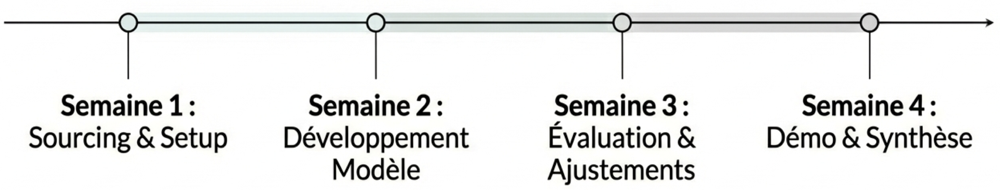

## Staffing & Budget

  

    <ul class="staff-list">
      <li class="staff-item">
        👤
        <strong>Data Scientist</strong> (100%)
      </li>
      <li class="staff-item">
        👤
        <strong>Data Engineer</strong> (50%)
      </li>
      <li class="staff-item">
        👤
        <strong>Tech Lead</strong> (20%)
      </li>
      <li class="staff-item">
        👤
        <strong>MLOps</strong> (20%)
      </li>
    </ul>
  

  

    <ul class="staff-list">
      <li class="staff-item">
        👤
        <strong>VP Product</strong> (20%)
      </li>
      <li class="staff-item">
        👤
        <strong>CDP</strong> (20%)
      </li>
      <li class="staff-item">
        👤
        <strong>Experts Mode</strong> (10%)
      </li>
    </ul>
  

## **Budget POC Estimé :** ~13.7k€

<!--
Section 8 : Planning & Staffing (Slide 8)
 
 Pour tenir ce délai de 4 semaines, on utilise 4 ingés, en plus du VP et du CDP.
 
 Nous aurons besoin d'un Data Scientist à 100% pour le modèle, et d'un Data Engineer à 50% pour préparer les données. Le Tech Lead et le MLOps interviendront en support (20%) pour préparer l'architecture.
 Ces compétences ont été identifiées en interne, nous n'avons pas besoin de prestataires.
 Le coût de staffing pour ce POC est estimé à 13 700 €."

💡 Antisèche (Q&A) :
• A-t-on la disponibilité ? : "Oui, le planning a été pré-validé avec les managers d'équipe."
• Ingénieur IA Chef de Projet ? : "C'est moi-même (ou ressource interne), je suis compté dans l'effort mais mon coût est absorbé dans les frais de fonctionnement internes (selon la convention P11)." 

-->

---

# Architecture Cible : Scalabilité et Performance sur Azure

**Flux de données :**

  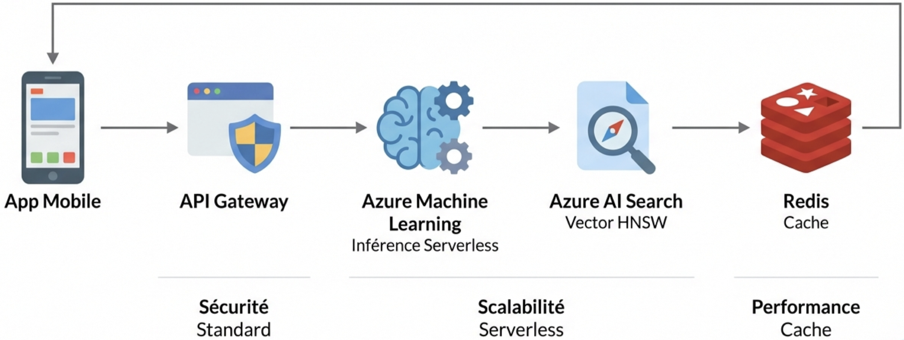

<!--
Section 9 : Architecture Technique (Slide 9)

 L'architecture sera déployée sur Azure, notre partenaire Cloud, pour maintenir la compatibilité avec l'existant.
 C'est une architecture moderne et scalable.

1. L'image arrive depuis le smartphone via l'API.
2. Elle est transformée en vecteurs par Azure Machine Learning.
3. Le moteur Azure AI Search trouve les produits similaires, et la réponse est mise en cache par Redis pour économiser les calculs sur les résulats fréquents. Tout cela est sécurisé et hébergé en France.
4. L'avantage de cette architecture, c'est qu'elle est 'Serverless' : elle s'adapte automatiquement à la charge, qu'il y ait 10 ou 10 000 utilisateurs, c'est auto-scalable. Il faudra bien-sûr placer des alertes budgets, on verra ça plus tard dans la partie financière.

💡 Antisèche (Q&A) :
• Pourquoi Azure et pas AWS ? : "Fashion-Insta est déjà sur l'écosystème Microsoft. Cela facilite l'intégration (SSO, Sécurité, Facturation) et réduit le temps de setup."
• Redis ? : "C'est une mémoire cache ultra-rapide pour stocker les résultats fréquents et économiser des calculs."
-->

---

# Gouvernance Technique : Matrice RACI
*Rôle central du Tech Lead pour garantir la cohérence technique.*
| Domaine de Responsabilité | Tech Lead Data | Data Scientist | Data Engineer | MLOps |
| :--- | :---: | :---: | :---: | :---: |
| **Architecture & Gouvernance** *(Design, Sécurité, Coûts, RGPD)* | **A** | C | C | C |
| **Data Pipelines & Search** *(Ingestion Blob, Azure AI Search)* | **A** | C | **R** | I |
| **Cœur Algorithmique** *(Entraînement, Optimisation)* | **A** | **R** | I | C |
| **Industrialisation** *(Déploiement AML, API, Monitoring)* | **A** | C | C | **R** |

<!--
Section 10 : Rôles & Responsabilités (Slide 10)

 Pour garantir une exécution rapide et sans faille, on a clarifié qui fait quoi via cette matrice RACI.
 Le Data Scientist est responsable de la qualité du modèle (le cerveau).
 Le Data Engineer assure que les données arrivent bien (la tuyauterie).
 Le MLOps s'occupe de la mise en production (l'usine).
 Et le Tech Lead valide l'ensemble de l'architecture pour éviter la dette technique.
 
 Cette organisation décloisonne les équipes et responsabilise chacun sur son expertise."

Pour simplifier cette présentation, je me suis focalisé sur les 4 ingé IA, et les principales phases du POC.

R – Responsible (Réalisateur) : C'est la personne qui fait le travail. Elle exécute la tâche. (Exemple : l'informaticien qui configure Azure AI Search).
A – Accountable (Approbateur / Responsable) : C'est la personne qui rend des comptes. Elle valide le travail et s'assure qu'il est fait. Il ne peut y avoir qu'un seul "A" par tâche.
C – Consulted (Consulté) : Ce sont les personnes dont on a besoin de l'avis ou de l'expertise pour avancer. La communication est bidirectionnelle. (Exemple : les experts mode de Fashion-Insta pour la validation des recommandations).
I – Informed (Informé) : Ce sont les personnes que l'on tient au courant de l'avancement ou de la fin d'une tâche. La communication est unidirectionnelle. (Exemple : la direction financière pour le suivi des alertes budgets).

💡 Antisèche (Q&A) :
• Qui décide en cas de désaccord technique ? : "C'est le Tech Lead Data (Rôle 'Accountable' sur l'Architecture)."
• Le MLOps est-il nécessaire pour le POC ? : "Oui, à 20%, pour s'assurer que ce qu'on construit sera déployable ensuite. On prépare l'industrialisation dès le jour 1." 
-->

---

# Roadmap de Déploiement : De l'expérimentation à l'échelle

  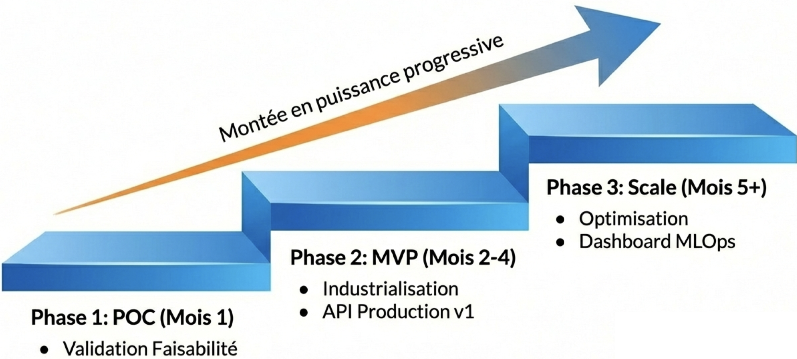

<!--
Section 11 : Timeline (Slide 11)

 Le POC n'est que le départ. Voici la feuille de route.
 Mois 1 : Le POC dont nous parlons, pour valider la technique.
 Mois 2 à 4 : Si le POC est validé, le MVP (Produit Minimum Viable).
 C'est là qu'on connecte le système à l'App et au stock réel. On passe en production.
 Mois 5 et plus : Le Scale. On optimise, on encaisse la charge et on surveille la performance dans le temps, le drift,... C'est un déploiement progressif pour maîtriser les risques.

💡 Antisèche (Q&A) :
• Pourquoi 3 mois pour le MVP ? : "Il faut intégrer l'API au front-end mobile, gérer la sécurité, les tests de charge, et former le support client."
• Drift ? : "C'est la dérive du modèle. Si la mode change (été/hiver), l'IA doit être ré-entraînée. C'est prévu en phase Scale." 
-->

---

# Analyse Financière : Des coûts maîtrisés et validés

### CapEx (Investissement)
# 161.5k€
**Staffing sur 2 ans :**
<ul>
  <li>Data Scientist</li>
  <li>Engineer</li>
  <li>MLOps</li>
  <li>Tech LEAD</li>
</ul>

### OpEx (Azure & Run)

  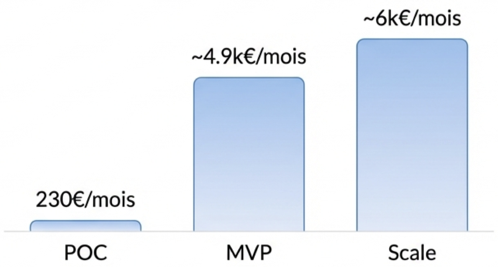

 

## **Total Investissement 2 ans :** ~292k€**
*(Basé sur Azure Pricing Calculator France Centre & TJM réels)*

<!--
Section 12 : Analyse Financière (Slide 12)

 Nous avons chiffré le projet sur 2 ans, sur la base des estimations du marketting.
 
 L'investissement initial de développement (CapEx) est de 161 500 €.
 Cela couvre le staffing de toute l'équipe du POC jusqu'au Scale.
 
 Les coûts de fonctionnement (OpEx), incluant l'infrastructure Azure et la maintenance humaine, sont très faibles au début et montent en puissance.
 
 Au total, sur 24 mois, le coût complet du projet est estimé à 292 000 €. Ces chiffres s'appuient sur les TJM réels de nos équipes et le calculateur officiel Azure.

💡 Antisèche (Q&A) :
• Le coût Azure semble faible ? : "Nous utilisons des instances managées et du serverless. On ne paie que ce qu'on consomme. Pour le POC, c'est à peine 230€."
• Maintenance Humaine ? : "Nous avons budgété 20% du temps d'un Data Scientist et d'un MLOps pour surveiller le modèle après le lancement." 
-->

---

# Rentabilité & ROI : Un projet autofinancé dès l'An 1

<h3 style="margin-top: 0;">Chiffres Clés</h3>
<ul style="list-style-type: none; padding: 0; text-align: center;">
  <li style="margin-bottom: 15px; font-size: 1.1em;">
    <strong>ROI 2 ans :</strong> 220%
  </li>
  <li style="margin-bottom: 15px; font-size: 1.1em;">
    <strong>Gains Est. :</strong> 936k€
  </li>
  <li style="margin-bottom: 15px; font-size: 1.1em;">
    <strong>Investissement :</strong> 292k€
  </li>
</ul>

  

 

## **Point Mort : 9 Mois** (Croisement des courbes Coûts Cumulés vs Gains Cumulés).

<!--
Section 13 : Rentabilité & ROI (Slide 13)

 Face à ces coûts, les gains sont significatifs.
 Avec 936k€ de revenus additionnels estimés sur 2 ans, le projet s'autofinance très vite.
 Le Retour sur Investissement (ROI) est de 220%.
 
 Le Point Mort (Break-even) est atteint au 9ème mois.
 Autrement dit : avant même la fin de la première année, le projet a remboursé son développement et commence à générer du profit net pour Fashion-Insta."
 
 Comme on est sur du serverless, le principal risque financier se situe sur un débordement de la durée pour la phase 2 (MVP), c'est la raison pour laquelle on a pris de la marge avec les 3 mois alloués.

💡 Antisèche (Q&A) :
• Et si on rate la cible marketing de moitié ? : "Le ROI reste positif (>100%). Le projet est très robuste financièrement."
• Quand commence-t-on à gagner de l'argent ? : "Dès le déploiement du MVP (Mois 4), les revenus rentrent. Ils couvrent le déficit initial au Mois 9." 
-->

---

# Risques & Conformité RGPD : Privacy by Design

  

    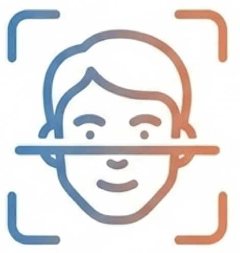
    
Anonymisation à la source

    
Floutage automatique des visages + Crop vêtement.

  

  

    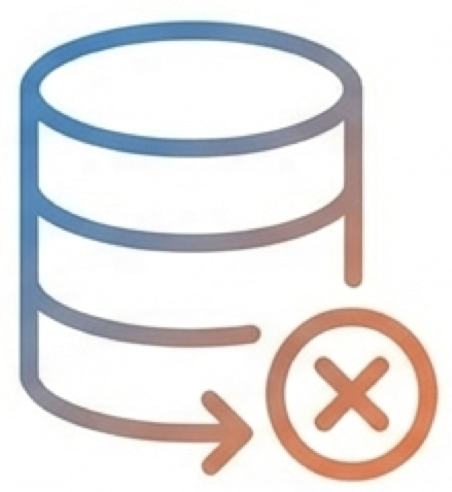
    
Zéro Persistance

    
Aucune image brute conservée. Uniquement des vecteurs mathématiques.

  

  

    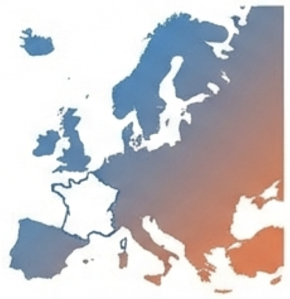
    
Souveraineté

    
Données isolées sur Azure France.

  

## **Conformité totale :** Nous traitons des vêtements, pas des identités.

<!--
Section 14 : Conformité RGPD (Slide 14)

 Pour la sécurité et la conformité, nous appliquons le 'Privacy by Design'.
1. Zéro visage : Nous floutons automatiquement les visages avant analyse, et on crop sur les vetements pour éviter le bruit des fond d'image (noms de rues, etc..)
2. Zéro stockage sensible : Nous ne gardons pas les photos des utilisateurs. Nous les transformons en vecteurs (des suites de chiffres) qui sont irréversibles. On ne peut pas recréer la photo depuis le vecteur.
3. Souveraineté : Toutes les données restent sur nos instances Azure en France.

Pour le preprocessing (floutage et crop), il faudra développer un petit script python et faire appel à OpenCV (flou) et le modèle Yolov8. Tout ça sera fait pendant le POC.

💡 Antisèche (Q&A) :
• Utilisez-vous les photos pour entraîner l'IA ? : "Non, nous utilisons DeepFashion (dataset public) pour l'entraînement. Les photos clients servent uniquement à la recherche instantanée (inférence) et sont jetées ensuite."
• OpenAI a-t-il accès aux données ? : "Non, nous utilisons Azure OpenAI Service avec un contrat 'Enterprise' qui garantit que Microsoft n'utilise pas nos données pour ses modèles." 
-->

---

# Conclusion & Décision

  

    

      
      

        <strong>Rentabilité Prouvée</strong> 
        (ROI 220%)
      

    

    

      
      

        <strong>Faisabilité Technique</strong> 
        (Architecture Azure Scalable)
      

    

    

      
      

        <strong>Sécurité Juridique</strong> 
        (Privacy by Design)
      

    

  

  

    <h3 style="margin: 0 0 15px 0; color: #000; font-size: 1.1em; border: none; text-align: center;">
      Demande de validation :
    </h3>
    

      Budget POC (13.7k€ + Infra)
    

    

      Objectif : Lancement POC.
    

  

  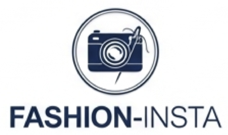

<!--
Section 15 : Conclusion (Slide 15)

 Pour résumer : C'est un projet Rentable (ROI 220%),
 Réalisable (Technologie maîtrisée en 4 semaines)
 et Sûr (RGPD Compliant).
 
 L'équipe est prête, l'architecture est validée.
 Je sollicite aujourd'hui votre validation pour débloquer le budget de 13 700 € nécessaire au lancement du POC dès que possible. 
 
 Merci de votre attention, je suis à votre disposition pour vos questions."

💡 Antisèche (Q&A) :
• Quels sont les risques restants ? : "Le principal risque est la qualité des photos utilisateurs (trop sombres/floues). Le POC sert à mesurer ce risque précisément."
• Prochaine étape si Go ? : "Kick-off meeting lundi matin avec l'équipe Data pour lancer l'ingestion des données." 

💰 BUSINESS & ROI (Alicia)
"Vos gains (+14%) sont trop optimistes. Et si on fait que +2% ?"

✅ Réponse : "Le modèle est robuste car les coûts (OpEx) sont variables (Serverless). Si moins de trafic = moins de coûts Azure. Le point de rentabilité recule (de 9 à 20 mois) mais le projet reste bénéficiaire à terme."

"Intégration Mobile difficile (Dette technique) ?"

✅ Réponse : "Architecture API-First (découplée). L'app mobile ne fait qu'afficher un JSON. Buffer de 2 sprints prévu dans le planning MVP. Sécurité via Feature Flipping (désactivation à distance si bug)."

"Que se passe-t-il si l'IA ne trouve rien ?"

✅ Réponse : "Gestion par Seuil de similarité. Si score trop bas → Fallback (Repli) sur une recherche par catégorie/couleur ('Voici nos robes rouges populaires') pour sauver la vente."

🛠️ TECH & ARCHI (Denis)
"Pourquoi ResNet50 (CNN) et pas ViT (Transformer) ?"

✅ Réponse : "Priorité à la latence < 100ms sur mobile. ResNet est plus léger et mature. ViT est trop lourd pour le POC. Optimisation prévue : Quantification INT8 via format ONNX."

"DeepFashion (Studio) vs Photos Clients (Floues/Moches) ?"

✅ Réponse : "Problème de Domain Shift anticipé. Solution : Data Augmentation agressive pendant l'entraînement (ajout artificiel de bruit, flou, rotation, baisse luminosité)."

"Nouvelle collection chaque semaine : faut-il tout réentraîner ?"

✅ Réponse : "Non. Le modèle apprend le style, pas les produits. Nouveaux produits = Simple inférence (calcul vecteur) + Ajout dans l'index Azure AI Search. Coût négligeable, zéro downtime."

⚖️ RGPD & ÉTHIQUE (DPO)
"Floutage des visages : Où est-il fait ?"

✅ Réponse : "POC = Cloud (RAM éphémère) avec suppression immédiate et transit TLS 1.3. Cible MVP = Edge Computing (sur le téléphone via SDK ML Kit) pour que le visage ne sorte jamais."

"Biais du dataset (Mannequins minces uniquement) ?"

✅ Réponse : "Les Embeddings analysent le vêtement (texture/forme), pas le corps. Vigilance maintenue : pour le MVP, enrichissement du dataset avec des images plus inclusives/diversifiées."

"Microsoft (OpenAI) utilise-t-il nos données ?"

✅ Réponse : "Non. Contrat Azure OpenAI Service Enterprise : nos données sont isolées, restent en France, et ne servent pas à l'entraînement des modèles globaux."

🎩 POSTURE "CHEF DE PROJET"
Si question trop code/spécifique (ex: librairie exacte) :

🃏 Joker : "En tant que Lead, j'ai fixé la contrainte (ex: Quantification). J'ai délégué le choix de la librairie au MLOps expert de l'équipe pour garantir la compatibilité Azure."

"Et vous, Damien, où êtes-vous dans ce tableau ?", voici la réponse exacte :

"En tant qu'Ingénieur IA et Chef de Projet, je me situe au-dessus de cette matrice d'exécution technique.

Mon rôle est celui du Chef d'Orchestre (Project Governance) :

Je suis le lien entre le Métier (Alicia/Marketing) et cette équipe technique.

Je m'assure que le Tech Lead garantit la qualité du code (Accountable technique).

Je suis moi-même Accountable (Responsable final) du respect du planning, du budget et de la réponse au besoin métier.

Ce RACI détaille spécifiquement comment les experts techniques collaborent entre eux pour livrer les briques logicielles."

-->
