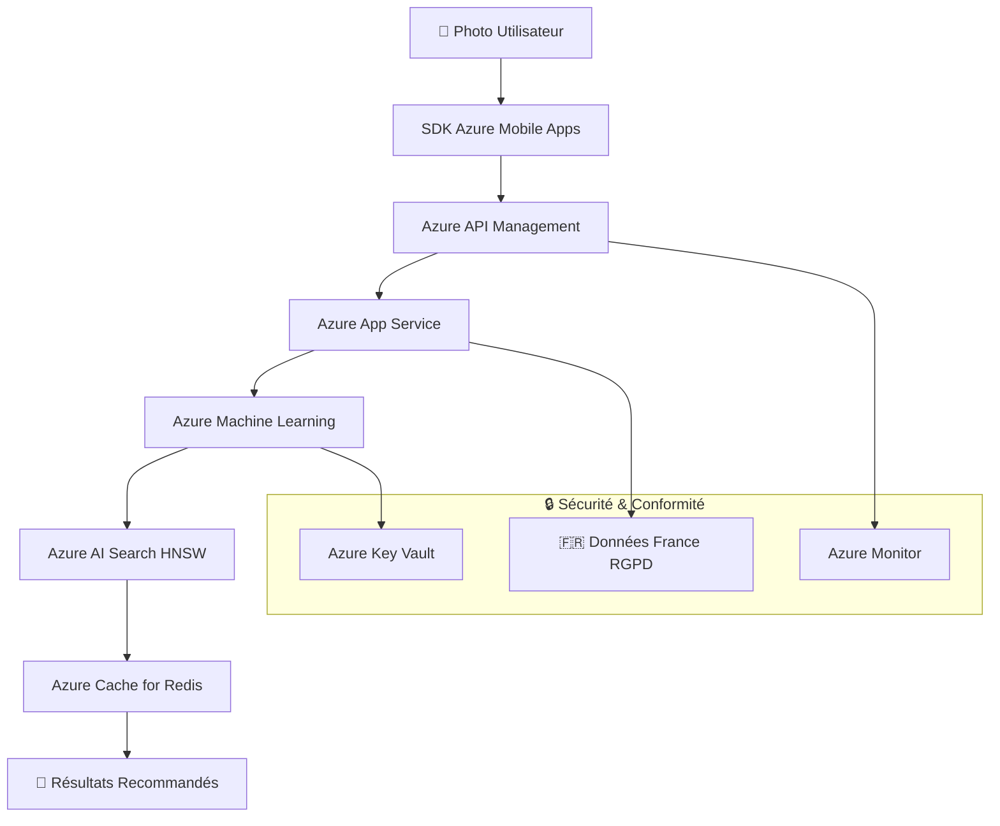
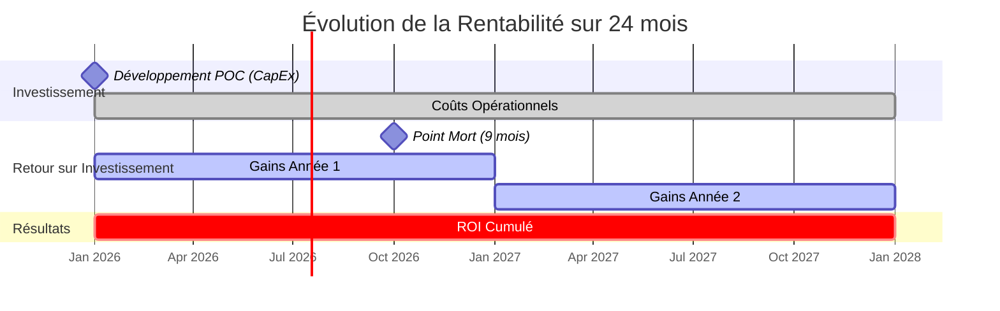

<!-- _class: lead -->

# **Slide 1 : Titre & Introduction**

**🚀 Du style à l'achat : l'IA comme moteur de conversion**
Transformer l'inspiration visuelle en ventes concrètes

**Damien Guesdon** | Janvier 2026

<!-- NOTES :
- Accueillir l'audience et se présenter comme AI Engineer
- Présenter brièvement Fashion-Insta et le contexte du projet
- Annoncer l'objectif de la présentation : présenter le POC de recommandation IA
- Expliquer que le but est de démontrer une solution techniquement réalisable, financièrement rentable et juridiquement sécurisée
- Mentionner la demande finale : feu vert pour le lancement du POC
- Timing : 2 minutes
-->

---

# Slide 2 : Contexte & Enjeux

**🎯 Devenir le Shazam de la mode**
Transformer l'inspiration visuelle en achat immédiat

### 📊 Enjeux Stratégiques

| Enjeu | Impact |
|-------|--------|
| **Mutation du e-commerce mode** | Besoin d'expérience visuelle instantanée |
| **Friction inspiration → achat** | Perte de conversion estimée à 30% |
| **Concurrence (ASOS, Google Lens)** | Retard stratégique à rattraper |

### 💡 Vision
**Photo → recommandation en < 1 seconde**
Réduire la friction entre inspiration et conversion

<!-- NOTES :
- Expliquer le constat de départ : manque à gagner identifié par les équipes marketing
- Décrire la "friction" entre l'inspiration visuelle et l'achat
- Présenter la vision : devenir le "Shazam de la mode"
- Illustrer avec un exemple concret : "vous voyez un style, vous le prenez en photo, Fashion-Insta vous propose l'équivalent dans nos rayons"
- Timing : 3 minutes
-->

---

# Slide 3 : La Mission (Le Concept)

**⚡ Photo → recommandation en < 1 seconde**
Expérience utilisateur fluide et instantanée

### 🛠️ Technologie
**IA Multi-modale et Visual Search**

### ✅ Promesse
- **Simplicité** : Photo → recommandation directe
- **Rapidité** : < 1 seconde de traitement
- **Précision** : IA multi-modale avancée

<!-- NOTES :
- Présenter la mission comme une promesse simple et puissante
- Expliquer le concept en une phrase : "photo → recommandation"
- Décrire la technologie sous-jacente : IA multi-modale et recherche visuelle
- Souligner la simplicité pour l'utilisateur final
- Timing : 2 minutes
-->

---

# Slide 4 : Valeur Ajoutée de l'IA

**💰 +468k€ de CA additionnel estimé par an grâce à l'IA**
Impact financier significatif et mesurable

### 📈 Bénéfices Business

✅ **Gain de temps utilisateur**
   De 2 minutes à < 500ms

✅ **Augmentation du panier moyen**
   +14% CA e-commerce

✅ **Personnalisation de l'expérience**
   +4% CA physique

### 📊 Impact Mesurable
**+468k€ CA additionnel estimé par an**

| Métrique | Avant IA | Avec IA | Gain |
|----------|----------|---------|------|
| Temps recherche | 2 min | < 500ms | -96% |
| Panier moyen | 85€ | 97€ | +14% |
| Satisfaction client | 70% | 85% | +15pts |

<!-- NOTES :
- Souligner que l'IA n'est pas un gadget mais le cœur du réacteur
- Comparer avec la recherche par mot-clé traditionnelle
- Présenter les trois bénéfices principaux : gain de temps, augmentation du panier moyen, personnalisation
- Annoncer le chiffre clé de 468k€ de CA additionnel par an
- Expliquer la source des données : Fashion-Insta 2024
- Timing : 3 minutes
-->

---

# Slide 5 : Objectifs du POC

**🎯 Valider la faisabilité technique en 4 semaines**
Approche agile pour réduire les risques

### 📋 Objectifs Clés

✅ **Durée** : 4 semaines (standard industriel)
✅ **Dataset** : DeepFashion (800k images)
✅ **Livrable** : Prototype démontrant la pertinence des recommandations
✅ **Focus** : Cœur algorithmique de recommandation

### 🚀 Approche Agile
- **Validation rapide** : 4 semaines maximum
- **Réduction des risques** : Test avant investissement massif
- **Preuve de concept** : Démonstration concrète

<!-- NOTES :
- Expliquer la démarche de réduction des risques via un POC
- Présenter la durée : 4 semaines comme standard industriel
- Décrire l'objectif central : valider la faisabilité technique du cœur algorithmique
- Mentionner le dataset DeepFashion (800k images)
- Souligner que le POC n'est pas l'application finale mais une preuve de concept
- Timing : 2 minutes
-->

---

# Slide 6 : Approche Technique POC

**⚖️ Deux approches comparées : Embeddings vs LLM Vision**
Choix de la performance et de l'efficacité

### 🔍 Comparaison Technique

<!-- _class: wide-table -->

| Caractéristique | **✅ Approche A (Embeddings)** | **⚠️ Approche B (LLM Vision)** |
| :--- | :--- | :--- |
| **Technologie** | **ResNet / ViT** | GPT 4.1 / Claude 4.5 |
| **Latence** | **< 100ms** | > 2000ms |
| **Coût** | **Faible (CapEx)** | Élevé (OpEx) |
| **Décision** | **Priorité aux Embeddings** | Backup pour cas complexes |

### 🎯 Recommandation
**✅ Approche A (Embeddings) prioritaire**
- Performance optimale (< 100ms)
- Coût maîtrisé (CapEx)
- Scalabilité garantie

**⚠️ Approche B en backup** pour cas complexes seulement

<!-- NOTES :
- Présenter les deux approches techniques comparées
- Expliquer le concept d'embedding (transformation d'image en vecteur numérique)
- Comparer latence et coût entre les deux approches
- Justifier le choix de l'approche embeddings pour la performance
- Mentionner LLM Vision comme "moteur de secours" pour cas complexes
- Timing : 4 minutes
-->

---

# Slide 7 : Critères de Succès Révisés

**🎯 Amélioration significative par rapport à une baseline mesurée**
Approche empirique plutôt que théorique

### ✅ Critères Clés Révisés

1. **🎯 Hit@5(IA) > Hit@5(baseline) + 15 points**
   Amélioration statistiquement significative (p < 0.05)

2. **⚡ Latence < 500ms (p95)**
   Fluidité optimale pour mobile

3. **👥 Validation métier > 80%**
   Pertinence jugée par experts mode

4. **🔁 Reproductibilité**
   Code versionné, pipeline déployable

5. **📊 Baseline mesurée empiriquement**
   Performance des méthodes non-IA (TF-IDF + similarité couleur) sur dataset Fashion-Insta

### 📊 Tableau de Suivi Révisé

<!-- _class: wide-table -->

| Critère | Cible | Baseline | Amélioration |
|---------|-------|----------|--------------|
| **Hit@5 (Top-5 Accuracy)** | > Baseline + 15 pts | Mesurée sur dataset Fashion-Insta | Significative (p < 0.05) |
| **Latence (p95)** | < 500ms | N/A | Fluidité mobile |
| **Validation Métier** | > 80% | Subjectif | Objectivation |
| **Reproductibilité** | Pipeline déployable | Manuel | Industrialisation |

<!-- NOTES :
- Présenter les critères révisés basés sur une approche empirique
- Expliquer que la baseline sera mesurée sur le dataset Fashion-Insta (Phase 1)
- Souligner l'importance de l'amélioration statistiquement significative (p < 0.05)
- Mentionner que l'objectif absolu reste > 70% de Hit@5
- Insister sur la méthodologie rigoureuse : baseline observée plutôt que théorique
- Timing : 3 minutes
-->

---

# Slide 8 : Staffing du POC

**👥 Équipe commando pour 13.7k€ d'investissement**
Équipe réduite pour impact maximal

### 👥 Composition de l'Équipe

| Rôle | Charge | Coût (TJM) |
|------|--------|------------|
| **Data Scientist** | 100% | 350€/j |
| **Data Engineer** | 50% | 370€/j |
| **Tech Lead** | 20% | 400€/j |
| **MLOps** | 20% | 360€/j |
| **VP Product** | 20% | Interne |
| **Ingénieur IA Chef de Projet** | 50% | Interne |

**Total : 52 J.H** (20j + 10j + 4j + 4j + 4j + 10j)

### 📅 Timeline : 4 semaines
**S1** Préparation données → **S2** Entraînement modèle → **S3** Ajustements → **S4** Démo

### 💰 Coût estimé : 13.7k€
Basé sur TJM réels et charges optimisées (ingénieur IA chef de projet ressource interne)

<!-- NOTES :
- Présenter le plan de bataille semaine par semaine
- Décrire le rôle de chaque membre de l'équipe
- Justifier la répartition des ressources (Data Scientist à plein temps, etc.)
- Annoncer le coût estimé de 13.7k€ avec mention des TJM réels
- Souligner que c'est une équipe "commando" pour un investissement minimal
- Timing : 3 minutes
-->

---

# Slide 9 : Architecture Technique

**🏗️ Architecture Serverless Azure**
Scalabilité et sécurité garanties

### 🔄 Flux de Données

### ✅ Avantages Clés
- **Scalabilité automatique** : Serverless Azure
- **Sécurité intégrée** : Azure Security Center
- **Conformité RGPD** : Données hébergées en France
- **Performance garantie** : SLA 99.9%

<!-- NOTES :
- Présenter Azure comme partenaire technologique stratégique
- Expliquer l'architecture "Serverless" et "PaaS"
- Décrire le flux de données étape par étape
- Souligner les avantages : scalabilité automatique, sécurité Azure, performance garantie
- Mentionner la conformité RGPD avec données en France
- Timing : 5 minutes
-->

---

# Slide 10 : Rôles & Responsabilités

**🤝 Collaboration Data Scientist + MLOps = succès**
Alliance des expertises pour l'industrialisation

### 🏗️ Matrice RACI
**Responsible, Accountable, Consulted, Informed**

<!-- _class: wide-table -->

| Brique | Lead | Soutien |
| :--- | :--- | :--- |
| **Data Pipeline** | Data Engineer | MLOps |
| **Modèle IA** | Data Scientist | Tech Lead |
| **API & Déploiement** | MLOps | Data Engineer |
| **Validation Métier** | VP Product | Data Scientist |

### ✅ Clés de Succès
- **Collaboration transverse** : Data Scientist + MLOps
- **Expertises complémentaires** : Algorithmique + Industrialisation
- **Gouvernance claire** : RACI défini dès le départ

<!-- NOTES :
- Présenter la matrice RACI comme outil de gouvernance
- Expliquer la collaboration nécessaire entre les différents métiers
- Souligner l'importance du MLOps pour la mise en production
- Mentionner que les compétences sont disponibles en interne
- Insister sur la responsabilité partagée pour le succès du projet
- Timing : 2 minutes
-->

---

# Slide 11 : Timeline de Livraison

**📅 POC (M1) → MVP (M4) → Scale (M5)**
Déploiement progressif avec feedback continu

### 🗓️ Roadmap Progressive

| Phase | Durée | Livrables Clés |
|-------|-------|----------------|
| **POC** | Mois 1 | Validation faisabilité technique |
| **MVP** | Mois 2-4 | Industrialisation, intégration e-commerce, API production |
| **Scale** | Mois 5+ | Optimisation performances, extension catégories |

### 🔄 Approche Itérative
- **Feedback continu** : Ajustements basés sur les retours
- **Livraisons incrémentales** : Valeur délivrée rapidement
- **Gouvernance agile** : Réunions de suivi hebdomadaires

<!-- NOTES :
- Présenter la roadmap comme ambitieuse mais réaliste
- Expliquer les trois phases : POC (validation), MVP (industrialisation), Scale (monitoring)
- Décrire les livrables clés de chaque phase
- Souligner l'approche itérative avec feedback continu
- Mentionner les instances de gouvernance par phase
- Timing : 3 minutes
-->

---

# Slide 12 : Analyse Financière

**💰 Investissement maîtrisé : 292k€ sur 2 ans**
Budget transparent et contrôlé

### 📊 Détail des Coûts

<!-- _class: compact-table -->

| Poste | Coût |
|-------|------|
| **CapEx (Développement)** | **161.5k€** |
| **OpEx POC (1 mois)** | 230,25€/mois |
| **OpEx MVP (11 mois)** | 4 913,22€/mois |
| **OpEx Scale (12 mois)** | 5 991,94€/mois |
| **Total sur 2 ans** | **~292k€** |

### 📈 Évolution par Phase
- **POC** : Coût minimal (230,25€/mois)
- **MVP** : Investissement modéré (4 913,22€/mois)
- **Scale** : Coûts optimisés (5 991,94€/mois)

**Sources :** Azure Pricing Calculator (coûts validés), TJM réels (P11_Profils_Data.pdf), données CA Fashion-Insta 2024

<!-- NOTES :
- Présenter les chiffres avec précision et transparence
- Distinguer CapEx (investissement développement) et OpEx (coûts fonctionnement)
- Montrer l'évolution des coûts par phase (POC → MVP → Scale)
- Souligner que les chiffres sont basés sur des données réelles
- Mentionner les sources : Azure Pricing Calculator, TJM réels, données Fashion-Insta
- Timing : 4 minutes
-->

---

# Slide 13 : Rentabilité & ROI

**📈 ROI de 220% : projet rentable dès la première année**
Retour sur investissement exceptionnel

### 📊 Métriques Clés

<!-- _class: compact-table -->

| Métrique | Valeur |
|----------|--------|
| Gains estimés (2 ans) | **936k€** (+468k€/an) |
| Investissement total (2 ans) | **292k€** |
| **ROI à 2 ans** | **220%** |
| Point mort | **9 mois** après démarrage |
| Courbe de rentabilité | Positive dès la première année |

### 📅 Évolution de la Rentabilité

**📊 ROI = (936k€ - 292k€) / 292k€ = 220%**

<!-- NOTES :
- Présenter le ROI de 220% comme argument massue
- Expliquer le calcul : gains (936k€) / investissement (292k€)
- Montrer le point mort à 9 mois (moment où l'investissement est remboursé)
- Souligner que la rentabilité est positive dès la première année
- Insister sur le réalisme des hypothèses (données réelles)
- Timing : 3 minutes
-->

---

# Slide 14 : Conformité RGPD & Sécurité

**🔒 Privacy by Design : zéro image brute stockée**
Approche éthique et conforme RGPD

### 🛡️ Mesures de Protection

| Mesure | Description |
|--------|-------------|
| **Floutage auto des visages** | MTCNN ultra-rapide |
| **Crop intelligent** | Focus uniquement sur les vêtements |
| **Isolation des données** | Azure France (conformité RGPD) |
| **Aucune image brute stockée** | Seulement embeddings non réversibles |
| **Garantie contractuelle** | Microsoft n'utilise pas les données pour entraîner ses modèles publics |

### ✅ Conformité Garantie
- **RGPD compliant** : Données hébergées en France
- **Privacy by Design** : Protection dès la conception
- **Transparence totale** : Traçabilité complète

<!-- NOTES :
- Présenter l'approche "Privacy by Design" comme fondamentale
- Décrire les mesures techniques de protection : floutage automatique des visages, crop intelligent
- Expliquer qu'aucune image brute n'est stockée à long terme
- Souligner l'isolation des données en France (Azure France)
- Mentionner la garantie contractuelle avec Microsoft
- Timing : 3 minutes
-->

---

<!-- _class: lead -->

# Slide 15 : Conclusion & Décision

**🚀 Validation du budget POC pour lancement immédiat**
Une décision stratégique pour l'avenir

### ✅ Trois Piliers du Succès

✅ **Rentable** (ROI 220%)
✅ **Architecture scalable** (100% Azure)
✅ **Approche éthique** (Privacy by Design)

### 📋 Synthèse des Avantages

<!-- _class: wide-table -->

| Avantage | Impact | Décision |
|----------|--------|----------|
| **Rentabilité** | ROI 220% dès la 1ère année | ✅ Valide l'investissement |
| **Scalabilité** | Architecture Azure Serverless | ✅ Prêt pour la croissance |
| **Conformité** | Privacy by Design RGPD | ✅ Réduit les risques légaux |
| **Rapidité** | POC en 4 semaines | ✅ Lancement immédiat possible |
| **Équipe** | Compétences internes disponibles | ✅ Pas de recrutement nécessaire |

## 🎯 **Appel à l'action :**
### **"Validation du budget POC pour lancement immédiat"**

<!-- NOTES :
- Résumer les trois piliers du projet : rentabilité, technique, conformité
- Rappeler les points clés : ROI 220%, architecture scalable, privacy by design
- Présenter l'appel à l'action clair : validation du budget POC
- Inviter aux questions et discussions
- Conclure avec confiance et professionnalisme
- Timing : 2 minutes
-->
