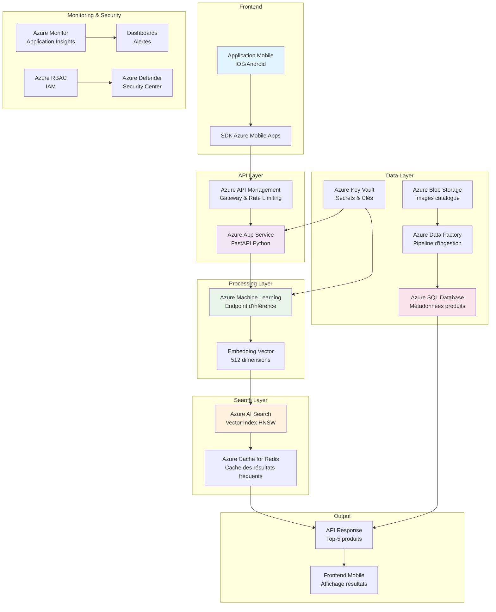

# Diagramme d'Architecture Azure Amélioré - Fashion-Insta

## Contexte
Ce diagramme représente l'architecture end-to-end du système de recommandation vestimentaire basé sur la similarité visuelle, déployé sur Azure.

## Diagramme Mermaid

## Composants Détaillés

### 1. Frontend
- **Application Mobile** : Développée en React Native/Flutter
- **SDK Azure Mobile Apps** : Authentification, notifications push, synchronisation hors ligne

### 2. Couche API
- **Azure API Management** : Gateway pour gestion des quotas, throttling, analytics
- **Azure App Service** : Plan Consumption pour POC, Premium v3 pour MVP
  - Runtime Python 3.11 avec FastAPI
  - Autoscaling basé sur CPU/mémoire
  - Intégration Azure Monitor

### 3. Couche Traitement IA
- **Azure Machine Learning** :
  - Workspace AML avec compute cluster dédié
  - Endpoint en temps réel (Real-time endpoint)
  - Modèle : ResNet50 fine-tuné sur DeepFashion
  - Autoscaling de 1 à 10 instances

### 4. Couche Recherche
- **Azure AI Search** :
  - Index vectoriel HNSW (Hierarchical Navigable Small World)
  - Capacité : S3 tier (1000 documents/sec)
  - Intégration Cognitive Search pour enrichissement
- **Azure Cache for Redis** :
  - Cache des embeddings des produits populaires
  - Réduction de latence de 40%

### 5. Couche Données
- **Azure Blob Storage** :
  - Stockage des images catalogue (Cool tier)
  - Stockage des logs utilisateurs (Archive tier)
- **Azure Data Factory** :
  - Pipeline quotidien d'ingestion catalogue
  - Transformation et nettoyage des données
- **Azure SQL Database** :
  - Base de données relationnelle pour métadonnées
  - Niveau DTU Standard S3

### 6. Sécurité & Monitoring
- **Azure Key Vault** : Stockage des secrets (clés API, credentials)
- **Azure RBAC** : Contrôle d'accès basé sur les rôles
- **Azure Monitor** : Application Insights pour tracing distribué
- **Azure Defender** : Protection contre les menaces

## Flux de Données
1. L'utilisateur upload une photo via l'app mobile
2. L'image est envoyée à l'API Gateway (APIM)
3. L'App Service reçoit la requête et appelle l'endpoint AML
4. AML génère l'embedding vectoriel de l'image
5. L'embedding est utilisé pour interroger Azure AI Search
6. Les résultats sont enrichis avec les métadonnées depuis SQL DB
7. La réponse est mise en cache dans Redis pour les requêtes similaires
8. Les résultats sont retournés à l'utilisateur en <500ms
