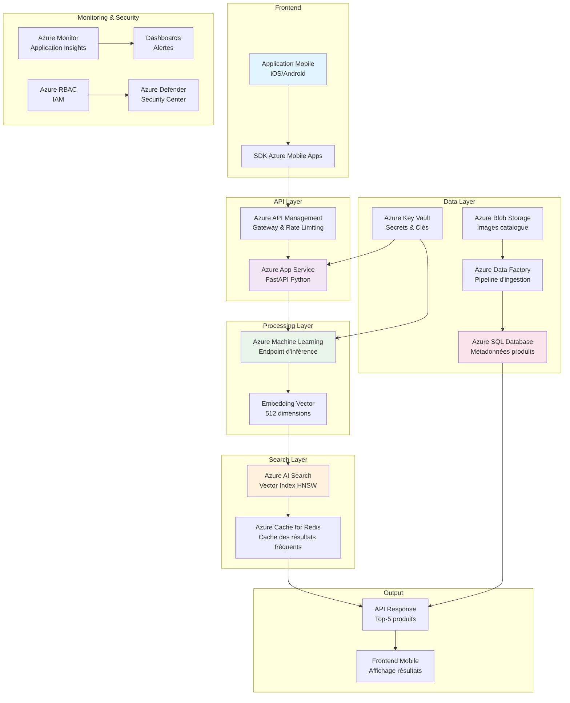

# Instructions pour l'Export des Diagrammes Mermaid

## Contexte
Les diagrammes Mermaid dans la présentation (`delivery/05_Presentation_Slides.md`) et les documents d'architecture doivent être exportés en images PNG pour éviter les problèmes de connectivité lors de la présentation.

## Diagrammes à Exporter

### 1. Diagramme d'Architecture Principal
**Fichier source** : `plans/architecture_diagram.md`
**Code Mermaid** :


### 2. Diagramme de la Présentation (Slide 9)
**Fichier source** : `delivery/05_Presentation_Slides.md` (lignes 37-75)
**Code Mermaid** : Identique au diagramme ci-dessus

## Méthodes d'Export

### Méthode 1 : Utilisation de mermaid.ink (En ligne)
1. Copier le code Mermaid (sans les backticks ```)
2. Aller sur https://mermaid.ink/
3. Coller le code dans l'éditeur
4. Télécharger l'image SVG ou PNG
5. Sauvegarder dans `delivery/images/mermaid/architecture_diagram.png`

### Méthode 2 : Utilisation de mermaid-cli (Local)
```bash
# Installation
npm install -g @mermaid-js/mermaid-cli

# Création du répertoire
mkdir -p delivery/images/mermaid

# Export du diagramme
mmdc -i plans/architecture_diagram.mmd -o delivery/images/mermaid/architecture_diagram.png -t neutral
```

### Méthode 3 : Utilisation de l'API mermaid.ink (Script)
```python
import requests
import base64
import zlib

def encode_mermaid_to_url(mermaid_code):
    compressed = zlib.compress(mermaid_code.encode('utf-8'))
    encoded = base64.urlsafe_b64encode(compressed).decode('utf-8')
    return f"https://mermaid.ink/svg/{encoded}"

# Téléchargement
url = encode_mermaid_to_url(mermaid_code)
response = requests.get(url)
with open('architecture_diagram.png', 'wb') as f:
    f.write(response.content)
```

## Fichiers à Mettre à Jour

Après export des images, mettre à jour les fichiers Markdown suivants :

### 1. `delivery/05_Presentation_Slides.md`
**Remplacer** :
```mermaid
...code...
```

**Par** :
```

```

### 2. `delivery/PRESENTATION.md`
**Remplacer** :
```

```

**Par** :
```

```

## Structure des Fichiers Résultants

```
delivery/
├── images/
│   ├── mermaid/
│   │   ├── architecture_diagram.png
│   │   └── presentation_diagram.png
│   ├── background.png
│   └── logo_projet.png
├── 05_Presentation_Slides.md
└── PRESENTATION.md
```

## Avantages de l'Export Local

1. **Fiabilité** : Pas de dépendance à une connexion internet
2. **Performance** : Chargement instantané des images
3. **Contrôle** : Versioning des images avec le code
4. **Portabilité** : Présentation fonctionne hors ligne
